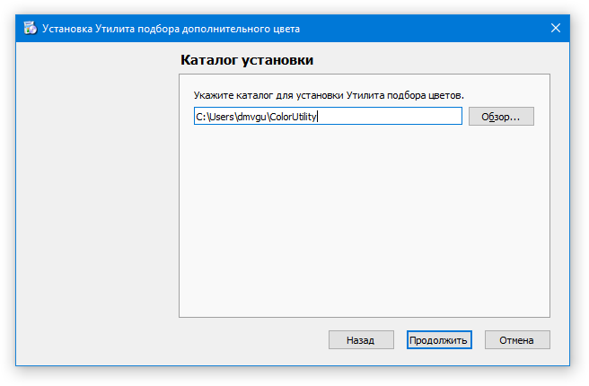

# Утилита подбора цвета

## Вкладка 1. Подбор дополнительного цвета. 
### Виджет выбора цветам
Позволяет настраивать цвет областей для подбора дополнительного оттенка. Выбор происходит с помощью кастомного виджета, поддерживающего 3 метода выбора : 
1. Стандартный ColorPeacker 
2. Слайдеры с синхронизированными спинбоксами (спинбоксы поддерживают редактирование тоже)
3. Random  

### **Скрин**
  
  
### Фишки
- Адаптивна к разрешению экрана
- Обновление в реальном времени без тормозов
- Квадрат центрирован
- Возможность выбора всех 3 цветов
- Задание случайного цвета для всех цветов
- Цвет по умолчанию – RGB (127,127,127)
- Возможность задания шага слайдера цветовой компоненты

### **Скрин**
  

-------

## Вкладка 2. Задание по цветовому восприятию.
Не реализовано 
Требуется разработать виджет задания координат объектов и прописать логику самих графических объектов
### Макет 
  

## Установщик
Собран автоматический установщик с помощью [Qt Installer Framework 3](http://doc.qt.io/qtinstallerframework/)
В установщик добавлена опция создания Шорткат'а в меню программ Windows

  

  

